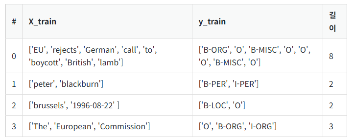

# 12. 태깅 작업(Tagging Task)

## 12-01 케라스를 이용한 태깅 작업 개요(Tagging Task using Keras)
여기서는 자연어 처리에서 중요한 태깅 작업과 이를 위한 양방향 LSTM 활용에 대해 다룬다.

### 태깅 작업
: 텍스트 내 각 단어의 유형을 식별하는 작업. 지도 학습에 속함

태깅을 해야하는 단어 데이터를 X, 레이블에 해당되는 태깅 정보 데이터는 y라고 이름을 붙였다고 하자. 데이터는 다음과 같은 구조를 가질 수 있다.   


### 시퀀스 레이블링 작업(Sequence Labeling Task)
위와 같이 입력 시퀀스 X = [x1, x2, x3, ..., xn]에 대하여 레이블 시퀀스 y = [y1, y2, y3, ..., yn]를 각각 부여하는 작업. 태깅 작업은 대표적인 시퀀스 레이블링 작업이다.

### 양방향 LSTM
```py
model.add(Bidirectional(LSTM(hidden_units, return_sequences=True)))
```     
양방향 LSTM은 이전 시점의 단어 정보 뿐만 아니라, 다음 시점의 단어 정보도 참고한다.

### RNN 다대다 문제
   
RNN의 은닉층은 모든 시점에 대해서 은닉 상태의 값을 출력할 수도, 마지막 시점에 대해서만 은닉 상태의 값을 출력할 수도 있다. 인자로 `return_sequences=True`를 넣을 것인지, 넣지 않을 것인지로(기본값은 return_sequences=False) 설정할 수 있는데, 태깅 작업의 경우에는 다 대 다(many-to-many) 문제로 return_sequences=True를 설정하여** 출력층에 모든 은닉 상태의 값을 보낸다**.

## 12-02 양방향 LSTM를 이용한 품사 태깅(Part-of-speech Tagging using Bi-LSTM)

양방향 LSTM을 이용해서 **품사 태깅** 모델을 만들 수 있다.

```py
import nltk
import numpy as np
import matplotlib.pyplot as plt
from tensorflow.keras.preprocessing.text import Tokenizer
from tensorflow.keras.preprocessing.sequence import pad_sequences
from tensorflow.keras.utils import to_categorical
from sklearn.model_selection import train_test_split

# 토큰화에 품사 태깅이 된 데이터 받아오기
tagged_sentences = nltk.corpus.treebank.tagged_sents()
print("품사 태깅이 된 문장 개수: ", len(tagged_sentences)) # 품사 태깅이 된 문장 개수:  3914

print(tagged_sentences[0])
# [('Pierre', 'NNP'), ('Vinken', 'NNP'), (',', ','), ('61', 'CD'), ('years', 'NNS'), ('old', 'JJ'), (',', ','), ('will', 'MD'), ('join', 'VB'), ('the', 'DT'), ('board', 'NN'), ('as', 'IN'), ('a', 'DT'), ('nonexecutive', 'JJ'), ('director', 'NN'), ('Nov.', 'NNP'), ('29', 'CD'), ('.', '.')]
```   
훈련을 시키려면 훈련 데이터에서 단어에 해당되는 부분과 품사 태깅 정보에 해당되는 부분을 분리시켜야 한다. -> [('Pierre', 'NNP'), ('Vinken', 'NNP')]와 같은 문장 샘플이 있다면 Pierre과 Vinken을 같이 저장하고, NNP와 NNP를 같이 저장하자.

파이썬의 **`zip()` 함수**는 동일한 개수를 가지는 시퀀스 자료형에서 동일한 순서에 등장하는 원소들끼리 **묶어주는** 역할    
```py
sentences, pos_tags = [], [] 
for tagged_sentence in tagged_sentences: # 3,914개의 문장 샘플을 1개씩 불러온다.
    sentence, tag_info = zip(*tagged_sentence) # 각 샘플에서 단어들은 sentence에 품사 태깅 정보들은 tag_info에 저장한다.
    sentences.append(list(sentence)) # 각 샘플에서 단어 정보만 저장한다.
    pos_tags.append(list(tag_info)) # 각 샘플에서 품사 태깅 정보만 저장한다.
```
각 문장 샘플에 대해서 **단어**는 `sentences`에, **태깅 정보**는 `pos_tags`에 저장하였다.

이제 케라스 토크나이저를 이용해 정수 인코딩을 하자.   
```py
def tokenize(samples):
  tokenizer = Tokenizer()
  tokenizer.fit_on_texts(samples)
  return tokenizer

src_tokenizer = tokenize(sentences) # 문장 데이터 전용 토크나이저
tar_tokenizer = tokenize(pos_tags) # 품사 태깅 정보 전용 토크나이저

# 정수 인코딩 수행
X_train = src_tokenizer.texts_to_sequences(sentences)
y_train = tar_tokenizer.texts_to_sequences(pos_tags)
```

다음으로 패딩으로 샘플들의 모든 길이를 통일해준다.    
```py
max_len = 150
X_train = pad_sequences(X_train, padding='post', maxlen=max_len)
y_train = pad_sequences(y_train, padding='post', maxlen=max_len)

print('훈련 샘플 문장의 크기 : {}'.format(X_train.shape))
print('훈련 샘플 레이블의 크기 : {}'.format(y_train.shape))
print('테스트 샘플 문장의 크기 : {}'.format(X_test.shape))
print('테스트 샘플 레이블의 크기 : {}'.format(y_test.shape))
```

결과:     
```
훈련 샘플 문장의 크기 : (3131, 150)
훈련 샘플 레이블의 크기 : (3131, 150)
테스트 샘플 문장의 크기 : (783, 150)
테스트 샘플 레이블의 크기 : (783, 150)
```

