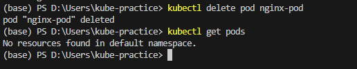

본 게시글은 아래 유튜브 강의를 바탕으로 쿠버네티스를 공부하며 정리한 내용입니다.   
※ [[인프런] 비전공자도 이해할 수 있는 쿠버네티스 입문/실전 - JSCODE 박재성](https://youtube.com/playlist?list=PLtUgHNmvcs6qoVrxB5jzZ4meINz_KL-Bl&si=rRqoe6fV7chgMz1q)

도커를 사용하지 않거나 또는 MSA구조를 하지 않는 구조에서는 굳이 K8S가 의미 없을 수도 있다. 그러나 최근 회사에서는 MSA의 구성을 가져가거나 컨테이너 개수가 기본적으로 많은 경우가 대부분이다. 이 때문에 그런 구조를 가진 회사에 취업하기 위해서는 쿠버네티스를 학습해야 한다.

# 쿠버네티스
## 쿠버네티스란?
: 다수의 컨테이너를 효율적으로 배포, 확장 및 관리하기 위한 오픈 소스 시스템.        
다수의 컨테이너를 쉽게 관리하기 위해 사용하는 '도커 컴포즈'와 비슷한 느낌. -> 대략적으로 Docker Compose의 확장판으로 생각하자.
컨테이너가 한두 개일 때는 쿠버네티스가 필요가 없지만 컨테이너가 10, 100, ..., 1000개가 되면 도커 컴포즈로는 관리가 어려워 쿠버네티스가 필요하다.

## 쿠버네티스 장점
- 컨테이너 관리 **자동화**
    - 예: 배포, 확장, 업데이트
- 부하 분산 = 로드 밸런싱
- 쉬운 스케일링
    - 쿠버네티스는 서버를 한 개 가지고 있다가 트래픽이 쏟아지면 그 서버의 개수를 늘릴 수 있음. -> 트래픽 정도에 따라 서버 수 자유롭게 변경 가능
- 셀프 힐링
    - 어떤 에러/장애로 프로그램이 죽을 경우 그 프로그램을 재시작 시킬 수 있음

# 파드(Pod)
## 파드란?
: 쿠버네티스에서 하나의 프로그램을 실행시키는 단위. ~= 도커에서의 **컨테이너** 개념, but 파드가 컨테이너를 품은 형태
- 쿠버네티스에서 가장 작은 단위
- 일반적으로 **하나의 파드 당 하나의 컨테이너**를 가짐

*2개의 결제 서버가 띄워져 있다 = 2개의 결제 서버 파드가 띄워져 있다*

*업로드 서버를 하나 띄우자 = 업로드 서버 하나를 파드로 띄우자*

# 웹 서버(Nginx)를 파드로 띄워보기
파드를 생성하는 방법에는 크게 두 가지가 있다.
- CLI 활용
- yaml 파일 활용

실제 현업에서는 귀찮은 CLI보다 yaml 파일을 활용하는 경우가 대부분이다. 따라서 여기서도 yaml 파일로 파드를 만들어보도록 할 것이다.

```yaml
apiVersion: v1
kind: Pod
# 의미: 쿠버네티스가 제공하는 여러 파일 유형 중 Pod를 만들 것이며,       
# apiVersion으로는 v1을 쓸 것이다         
# ❗ 아직은 잘 모르겠지만, 파드를 생성할 떄에는 api 버전을 v1으로 써주는 게 정석이라고 함

metadata: # Pod에 대한 기본 정보
  name: nginx-pod # 이름 붙이기

spec: # Pod에 대한 세부 정보
  containers: # 파드에 들어가는 컨테이너 정보
    - name: nginx-container # 컨테이너 이름
      image: nginx:latest # 컨테이너를 띄우기 위해 사용하는 이미지. nginx:태그명 
      ports:
        - containerPort: 80 # nginx가 어떤 포트를 쓸지 "명시".
        # 컨테이너에서 nginx 프로그램을 띄우는 포트 작동에 영향을 하나도 끼치지 않으며, 
        # 그저 가독성을 위한 문서화 역할!
```     
그리고 위와 같은 yaml 파일을 manifest 파일이라고 부른다.    
manifest 파일: 쿠버네티스에서 다양한 리소스(파드 등)를 생성하고 관리하기 위해 사용하는 파일

위 코드를 작성하고 `kubectl apply -f 파일명.yaml` 명령어를 실행하여 띄워보자.      
```
kubectl apply -f nginx-pod.yaml
```

로컬 컴퓨터 ⊃ 파드 ⊃ 컨테이너       
파드&컨테이너는 같은 네트워크를 공유해서 사용한다. 반면, 로컬 컴퓨터는 파드&컨테이너와 독립적인 별도의 네트워크를 사용한다. -> 로컬 컴퓨터의 localhost:80 포트 ≠ 파드&컨테이너의 localhost:80 포트 (서로 다른 영역! 서로 다른 주소를 뜻함) 

그래서 로컬 컴퓨터에서는 파드로 띄운 nginx에 아무리 요청을 보내도 응답이 없던 것이다.
따라서 우리는
    - 1. 파드 안에 접속한 다음 파드에서 nginx에 요청을 보내거나,
    - 2. 파드의 내부 네트워크를 외부(로컬 컴퓨터)에서도 접속할 수 있도록 포트를 연결(=포트 포워딩) 
면 응답을 받을 수 있을 것이다.

방법 1. 파드 접속    
    도커의 컨테이너 접속 명령어와 유사한 아래 명령어를 실행해보자.      
```
kubectl exec -it nginx-pod -- bash
```


응답을 잘 받아왔다.

방법 2. 포트 포워딩

```
kubectl port-forward pod/파드명 로컬에서의 포트번호:파드에서의 포트번호
예시: kubectl port-forward pod/nginx-pod 80:80
```

결과:   
      
      
포트 포워딩 성공!      
포트 포워딩 상태는 계속 유지되며, Ctrl+C를 눌러 끊을 수 있다.

파드 삭제 명령어:       
```
kubectl delete pod 파드명
예시: kubectl delete pod nginx-pod
```


`kubectl get pods`로 상태를 확인해보면 파드가 잘 삭제된 것을 확인할 수 있다.

----

# 쿠버네티스 스터디            
## 쿠버네티스 실행 방법
- kind: 가벼운 테스트에 이용
- Minikube: k8s의 완전한 기능을 활용할 때 사용. 일반적으로 사용하는 방법인 듯함.

## 쿠버네티스 관련 개념 - 노드, Deployment, 서비스
### 노드(Node)
    - 쿠버네티스의 워커 머신
    - 파드들을 갖고있는 큰 틀의 컨테이너
    - 파드는 언제나 노드 상에서 동작하며 노드 하나에 여러 개의 파드가 있다.

### Deployment
    - 애플리케이션의 배포 및 관리를 자동화하는 쿠버네티스 오브젝트.
    - 실제 가상머신 상에 애플리케이션을 안정적이고 반복적으로 배포하는 설정
    - 원하는 상태(컨테이너 개수, 이미지 버전 등)를 정의하고, 이를 유지하도록 쿠버네티스가 자동으로 관리해준다.

### 서비스(Service)
    - 파드 간의 통신을 관리하거나, 외부-파드 간의 연결 설정에 사용하는 **추상화된 네트워크 리소스**      
    - 파드의 **IP 고정점** 제공

## 서비스 유형
- NodePort: 클러스터 외부에서 접근 가능하도록 각 노드의 고정된 포트를 엶
- LoadBalancer: 외부의 로드 밸런서를 설정하여 서비스에 대한 **공인 IP** 제공
 
쿠버네티스의 셀프 힐링은 사람이 매번 재시작시키는 것을 대신 해줘서 좋은 것 같다. 오죽하면 이런 기능이 없는 경우 회사 PM이 서버 다운 된 거 살리러(띄우러) 다니는 역할을 담당한다니 말이다.     
서버 다운이 잦은 이유: 사람의 코딩이 완벽하지 않으니 메모리 관리가 안돼서 메모리가 계속 쌓이다가 뻗는 것. 하루에 30번은 서버 다운 되는 것 같다고 함. 게임회사는 다운이 흔한 일이라 보통 주1회는 서버 다운했다 다시 올림.