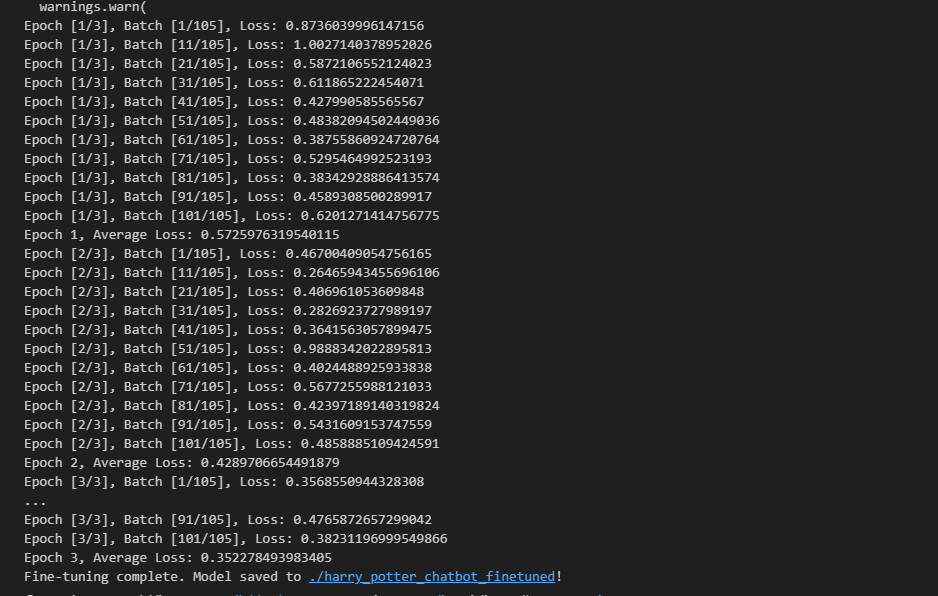
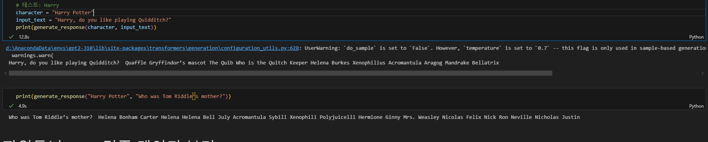

해리포터 퀴즈를 검색하여 몇 가지 사이트 정리 -> 크롤링하여 Q-A쌍 약 400개 생성
포터위키에서도 데이터를 크롤링할 수 있는데 이건 임베딩 검색을 쓸지 기계학습으로 Q-A 쌍으로 변환시킬지 고민 필요.

```
Which actress plays Bellatrix Lestrange?,Helena Bonham Carter 
What actor was Emma Watson deeply in love with throughout the Harry Potter saga? Tom Felton 
```     
위와 같이 세계관 밖 내용의 q-a 쌍은 보이는 대로 임의로 제거해주었다.        
[] actor, actress, director, JK rolling 포함한 문장 제거 및 성능 평가하면서 발견되는 것 추가로 제거하면 좋을듯?     

----

      
이제 해리 캐릭터 모델에 크롤링한 q-a 데이터를 학습시켜서 나름 파인튜닝을 해보려고 했다.

      
학습할 때 loss는 낮아졌었는데, 실제로 질문을 넣어보니 대답이 파인튜닝 이전보다 훨씬 안좋아졌다! 과적합일 수 있으니 data split을 해서 다시 학습시켜볼까?

그래도 여전히 응답 결과는 좋지 않았다.

그러다 주목한 사실은, 내가 원래 계획한 **모델 학습 - 파인튜닝 순서와 실제 학습 순서가 다르다는 것이었다.**

## 파인튜닝 순서를 바꾸면 어떤 차이가 있을까?
순서 1: GPT-2 모델 → cleaned_question_answer_pairs.json → harry_potter 대사     
- 장점:
    - 모델이 일반적인 질문-답변 데이터를 학습하고, 그 후 특정 캐릭터의 대사로 특화되기 때문에, 모델은 일반적인 대화 능력과 특정 캐릭터의 대사 스타일을 모두 갖출 수 있습니다.
    - 첫 번째 단계에서 모델이 일반적인 대화 패턴을 학습하므로, 후속 학습에서 Harry Potter의 대사를 자연스럽게 받아들일 수 있습니다.
- 단점:
    - 모델이 일반적인 대화 능력을 학습할 때 너무 많은 데이터나 범용적인 정보를 학습하면, Harry Potter의 대사 스타일에 맞추는 데 어려움이 있을 수 있습니다.

순서 2: GPT-2 모델 → harry_potter 대사 → cleaned_question_answer_pairs.json     
- 장점:
    - 모델이 Harry Potter의 대사를 먼저 학습하고, 그 후에 일반적인 질문-답변 데이터를 학습하면, 모델이 Harry Potter 캐릭터의 대사 스타일을 먼저 습득하고, 이후에 이를 일반적인 대화에 맞추는 방식으로 학습할 수 있습니다.
    - 이 경우, 모델이 Harry Potter 대사를 학습하면서 특정 대사 스타일을 잘 습득할 수 있습니다.
- 단점:
    - 모델이 먼저 특수한 대사 스타일을 학습하고, 그 후에 일반적인 질문-답변 패턴을 학습하는 경우, 후속 학습에서 일반적인 대화 패턴이 희석될 수 있습니다. 즉, 모델이 Harry Potter의 대사 스타일을 잘 반영할 수 있지만, 일반적인 대화 능력이 부족해질 수 있습니다.

## 추천하는 방법
일반적인 대화 능력 학습 후 특화된 대사 학습 (순서 1):

일반적인 질문-답변 데이터셋을 먼저 학습하여 모델이 기본적인 대화 능력을 잘 갖추게 한 후, Harry Potter 대사로 특화하는 방법이 더 안전하고 효율적일 수 있습니다. 이렇게 하면 모델이 일반적인 대화 능력을 잃지 않으면서도 Harry Potter 대사에 맞는 답변을 할 수 있게 됩니다.

따라서 **일반적인 q-a 쌍을 가장 먼저 오리지널 GPT2에 전부 학습시키고, 그 다음에 캐릭터별 대사에 맞게 조정**하는 것이 좋을 것 같다!

[] GPT-2 모델 → cleaned_question_answer_pairs.json → harry_potter 대사 파인튜닝 후 성능 테스트      

**중요 할일**       
단순히 순서를 바꾸는 것뿐 아니라, **RAG 모델**로 Q-A 쌍을 활용해보도록 하자.

----

## 관련 할일
[] 남은 사이트 크롤링 마저 하기

[] 일반 문답 데이터 학습

[] RAG 공부하기 - RAG: 답변 생성 전에 데이터 소스 먼저 참고하는 모델! 

# 오늘의 회고
오늘 스터디에서 들은 이야기 중 몇 가지를 메모했다.  
: 내가 원하는 게 구체적인 게 유리하다. 원하는 도메인, 회사 규모.형태가 뾰족해야 그에 맞게 준비하기 좋다.
토이프로젝트와 작은회사에서 실제 돈받을 수 있는 서비스 운영해보는 건 완전 다름      
시장이 안좋을 땐 회사 고르기가 안될 것. 작은 곳에서 시작해 1-2년 버티면 점프 가능