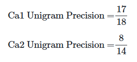

# 14. RNN을 이용한 인코더-디코더
RNN의 다 대 일(many-to-one) 구조로 텍스트 분류를 풀 수 있었고, 다 대 다(many-to-many) 구조로는 개체명 인식이나 품사 태깅과 같은 문제를 풀 수 있었다.

그러나 이번에 살펴볼 RNN의 구조는 앞에서 살펴본 구조와 조금 다르다.

하나의 RNN을 인코더, 또 다른 하나의 RNN을 디코더라는 모듈로 명명하고 두 개의 RNN을 연결해서 사용하는 **인코더-디코더 구조**이다.

인코더-디코더 구조는 주로 입력 문장과 출력 문장의 길이가 다를 경우에 사용한다. 예: 번역기, 텍스트 요약

## 참고: 케라스의 함수형 API(Keras Functional API)     

```
from tensorflow.keras.models import Sequential
from tensorflow.keras.layers import Dense

model = Sequential()
model.add(Dense(3, input_dim=4, activation='softmax'))
```     
위와 같은 Sequential API는 직관적이고 편리하지만 단순히 층을 쌓는 것만으로는 구현할 수 없는 복잡한 신경망을 구현할 수 없다.

Functional API는 각 층을 일종의 함수(function)로서 정의한다. 그리고 각 함수를 조합하기 위한 **연산자**들을 이용하여 신경망을 설계한다.

functional API를 사용하면 아래와 같이 다중 입력과 다중 출력을 가지는 모델도 만들 수 있다.
```
# 최종 완성된 다중 입력, 다중 출력 모델의 예
model = Model(inputs=[a1, a2], outputs=[b1, b2, b3])
```

자세한 내용은 [https://wikidocs.net/38861](https://wikidocs.net/38861)에서 살펴볼 수 있다.

## 시퀀스-투-시퀀스(Sequence-to-Sequence, seq2seq)
: 입력된 시퀀스로부터 다른 도메인의 시퀀스를 출력하는 다양한 분야에서 사용되는 모델     
예: 챗봇(Chatbot), 기계 번역(Machine Translation), 내용 요약(Text Summarization), STT(Speech to Text)

     
- seq2seq는 크게 인코더와 디코더라는 두 개의 모듈로 구성
    - 인코더는 입력 문장의 모든 단어들을 순차적으로 입력받은 뒤에 마지막에 이 모든 단어 정보들을 압축해서 **하나의 벡터**로 만든다 -> "**컨텍스트 벡터(context vector)**"
    - 입력 문장의 정보가 하나의 컨텍스트 벡터로 모두 압축되면 인코더는 컨텍스트 벡터를 디코더로 전송
    - 디코더는 컨텍스트 벡터를 받아서 번역된 단어를 한 개씩 순차적으로 출력

컨텍스트 벡터 예시:     
     
물론 실제 현업 seq2seq 모델에서는 보통 수백 이상의 차원을 갖고있다.

## Seq2Seq 내부

인코더 아키텍처와 디코더 아키텍처의 내부는 사실 두 개의 RNN 아키텍처이다.       
```
인코더 =입력 문장을 받는 RNN 셀 
디코더 = 출력 문장을 출력하는 RNN 셀
```
(성능을 위해 실제로는 바닐라 RNN이 아니라 LSTM 셀 또는 GRU 셀들로 구성)     

그림에서 구조를 자세히 살펴보자.

- 인코더
    - 입력 문장은 단어 토큰화를 통해서 **단어 단위**로 쪼개지고 단어 토큰 각각은 **RNN 셀의 각 시점의 입력**이 됨.
    - 인코더 RNN 셀의 마지막 시점의 은닉 상태를 디코더 RNN 셀로 넘겨줌
    - 컨텍스트 벡터는 디코더 RNN 셀의 첫번째 은닉 상태에 사용

- 디코더
    - 초기 입력: 문장의 시작을 의미하는 심볼 <sos> 입력
    - <sos>가 입력되면, 다음에 등장할 확률이 높은 단어를 예측
    - 첫번째 시점에서 예측된 단어 je를 다음 시점의 RNN 셀에 입력
    - 반복...
    - 문장의 끝을 의미하는 심볼인 <eos>가 다음 단어로 예측될 때까지 반복!

그런데, 이 이야기는 테스트 과정(또는 실제 번역기를 사람이 쓸 때) 동안에 일어나는 일이다. seq2seq는 훈련 과정과 테스트 과정의 작동 방식이 조금 다르다. 

훈련 과정에서는 (인코더가 디코더에게 보낸) '컨텍스트 벡터'와 실제 정답인 '<sos> je suis étudiant'를 입력했을 때 'je suis étudiant <eos>'가 나와야 된다고 정답을 알려주면서 훈련한다.

반면 테스트 과정에서는 디코더가 오직 '컨텍스트 벡터'와 '<sos>'만을 입력으로 받은 후에 다음에 올 단어를 예측하고, 그 단어를 다음 시점의 RNN 셀의 입력으로 넣는 행위를 반복한다.

## 워드 임베딩
자연어 처리에서 텍스트를 벡터로 바꾸는 방법으로 주로 워드 임베딩이 사용된다. -> seq2seq에서 사용되는 모든 단어들은 임베딩 벡터로 변환 후 사용


- 현재 시점(time step)을 t라고 할 때, RNN 셀은 t-1에서의 은닉 상태와 t에서의 입력 벡터를 입력으로 받고, t에서의 은닉 상태를 만든다.
- 그리고 다음 시점에 해당하는 t+1의 RNN 셀의 입력으로 현재 t에서의 은닉 상태를 입력으로 보낸다.

=> 현재 시점 t에서의 은닉 상태는 과거 시점의 RNN 셀에서의 모든 은닉 상태의 값들의 영향을 누적해서 받아온 값     
=> 컨텍스트 벡터는 사실 **인코더에서의 마지막 RNN 셀의 은닉 상태값**

따라서 입력 문장의 모든 단어 토큰들의 정보를 요약해서 담고있다.

       
출력 단어로 나올 수 있는 단어들은 다양한 단어들이 있다. 이때 seq2seq 모델은 선택될 수 있는 모든 단어들로부터 하나의 단어를 골라서 예측하기 위해 바로 **소프트맥스 함수**를 사용한다!

- 각 시점(time step)의 RNN 셀에서 출력 벡터가 나오면
- 해당 벡터는 소프트맥스 함수를 통해 출력 시퀀스의 각 단어별 확률값을 반환
- 디코더는 이 확률값으로 출력 단어를 결정

이것은 가장 가장 기본적인 seq2seq 구조이며, 나중에 더 나아가서 어텐션 메커니즘이라는 방법을 통해 문맥을 더욱 반영할 수 있는 컨텍스트 벡터를 구하여 매 시점마다 하나의 입력으로 사용할 수도 있다.

## 문자 레벨 기계 번역기 구현
케라스 개발자 프랑수아 숄레의 블로그의 유명 게시물인 'sequence-to-sequence 10분만에 이해하기' 참고하면 좋다.        

[해당 게시물 링크](https://blog.keras.io/a-ten-minute-introduction-to-sequence-to-sequence-learning-in-keras.html)

기계 번역기를 훈련시키기 위해서는 훈련 데이터로 병렬 코퍼스(parallel corpus)가 필요하다.

병렬 코퍼스: **두 개 이상의 언어가** 병렬적으로 구성된 코퍼스

프랑스-영어 병렬 코퍼스 fra.txt를 사용한다. 이 데이터는 하나의 샘플이 영어 - 프랑스어 문장 사이에 탭으로 구분되는 구조로 이루어져 있다.   
```
Watch me.           Regardez-moi !
```

(14-1 실습 코드리뷰)

## 교사 강요(Teacher forcing)
그런데, 현재 시점의 디코더 셀의 입력은 오직 이전 디코더 셀의 출력을 입력으로 받는다고 설명하였는데 decoder_input이 왜 필요할까?

이전 시점의 디코더 셀의 예측이 틀렸는데 이를 현재 시점의 디코더 셀의 입력으로 사용하면 현재 시점의 디코더 셀의 예측도 잘못될 가능성이 높고 연쇄 작용으로 디코더 전체의 예측을 어렵게 한다.

=> 따라서 훈련 과정에서는 이전 시점의 디코더 셀의 출력을 현재 시점의 디코더 셀의 입력으로 넣어주지 않고, **이전 시점의 실제값**을 현재 시점의 디코더 셀의 입력값으로 하는 방법을 사용한다.

이와 같이 RNN의 모든 시점에 대해서 이전 시점의 예측값 대신 실제값을 입력으로 주는 방법을 교사 강요라고 한다.

( seq2seq 모델 설계 코드 리뷰)


## BLEU(Bilingual Evaluation Understudy Score)
: 번역이라는 섬세한 자연어 처리 태스크를 기계적으로 평가할 수 있는 방법

언어 모델(Language Model)의 성능 측정을 위한 평가 방법으로 펄플렉서티(perplexity, PPL)가 있다. 기계 번역기에도 PPL을 평가에 사용할 수는 있지만, PPL은 번역의 성능을 직접적으로 반영하는 수치라 보기엔 어렵다.

- BLEU는 기계 번역 결과와 사람이 직접 번역한 결과가 얼마나 유사한지 비교하여 번역에 대한 성능을 측정하는 방법
- 측정 기준은 n-gram에 기반한다.
- 언어에 구애받지 않고 사용할 수 있으며, 계산 속도가 빠름
- PPL과는 달리 높을 수록 성능이 더 좋음을 의미

### 1) 단어 개수 카운트로 측정하기(Unigram Precision)
```
Example 1
Candidate1 : It is a guide to action which ensures that the military always obeys the commands of the party.
Candidate2 : It is to insure the troops forever hearing the activity guidebook that party direct.
Reference1 : It is a guide to action that ensures that the military will forever heed Party commands.
Reference2 : It is the guiding principle which guarantees the military forces always being under the command of the Party.
Reference3 : It is the practical guide for the army always to heed the directions of the party.
```

- 유니그램 정밀도(Unigram Precision)        
      

Ca1의 단어들은 얼추 훑어만봐도 Ref1, Ref2, Ref3에서 전반적으로 등장하는 반면, Ca2는 그렇지 않다. 이는 Ca1이 Ca2보다 더 좋은 번역 문장임을 의미



### 2) 중복을 제거하여 보정하기(Modified Unigram Precision)
```
Example 2
Candidate : the the the the the the the
Reference1 : the cat is on the mat
Reference2 : there is a cat on the mat
```

유니그램 정밀도에 따르면 7/7=1이라는 최고의 성능을 받게 되어버림

-> 이를 보정하기 위해, 분자 계산시 Ca의 유니그램이 이미 Ref에서 매칭된 적이 있었는지를 고려


Count_clip = min(7, 2) = 2      
=> MUP = 2/7로 보정

### 3) 보정된 유니그램 정밀도 (Modified Unigram Precision) 구현하기

(홈페이지 실습 코드)