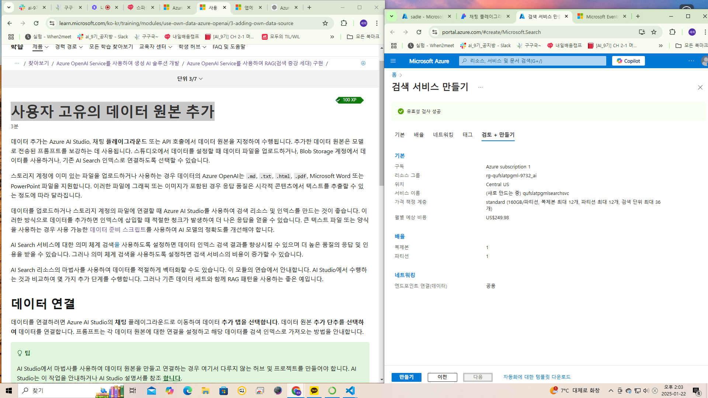
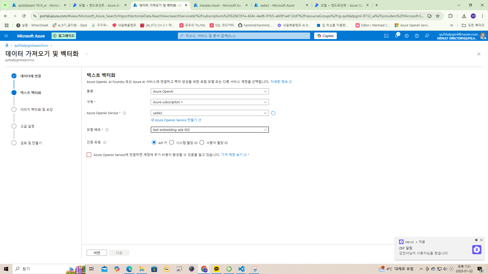

GPT-4o mini: 가장 비용 효율적인 소형 모델이며 비전 기능이 있음



검색 서비스. 월 구독 비용 이상한데.

```py
'''
Azure OpenAI 리소스에 액세스하도록 앱 구성
'''
# Add OpenAI library
from openai import AzureOpenAI

deployment_name = '<배포 이름>' 

# Initialize the Azure OpenAI client
client = AzureOpenAI(
        azure_endpoint = "https://<리소스 이름>.openai.azure.com/",
        api_key='<본인 api 키>',  
        api_version="2024-08-01-preview" #  Target version of the API, such as 2024-02-15-preview
        )

'''
Azure OpenAI 리소스 호출: 
Azure OpenAI에 대한 연결을 구성한 후 모델에 프롬프트를 보낸다.
'''

response = client.chat.completions.create(
    model=deployment_name,
    messages=[
        {"role": "system", "content": "You are a helpful assistant."},
        # {"role": "user", "content": "What is Azure OpenAI?"}
        {"role": "user", "content": "How do you make a Polyjuice Potion?"}
    ]
)
generated_text = response.choices[0].message.content

# Print the response
print("Response: " + generated_text + "\n")
```

결과:       
```
Response: The Polyjuice Potion is a complex and advanced potion from the "Harry Potter" series, specifically described in "Harry Potter and the Chamber of Secrets." Making this potion requires several intricate steps and a number of specific ingredients. Here’s a general outline of the process, though please note this is purely fictional and meant for entertainment purposes.

### Ingredients:
1. Lacewing flies (stewed for 21 days)
2. Leech juice
3. Shredded Boomslang skin
4. A piece of the person you wish to turn into (for example, a hair)
5. A number of other magical ingredients (specific details can vary)

### Steps:
1. **Prepare the Lacewing Flies**: Begin with the lacewing flies, which should 
be stewed in a cauldron for exactly 21 days. Make sure to monitor the temperature and ensure it simmers gently.

2. **Add Leech Juice**: Once the 21 days are complete, add leech juice to the mixture. Stir carefully.

3. **Incorporate Shredded Boomslang Skin**: Add the shredded boomslang skin to 
the potion. This will be crucial for the potion's transformative properties.   

4. **Add the Piece of the Intended Form**: Finally, add a piece of the individual you wish to transform into (such as a hair). This is a critical step, as the potion will mimic the characteristics of that person.

5. **Brewing Time**: Let the potion brew for a specific period. The exact brewing time is unspecified, but it should be given adequate time to reach its full 
potential.

6. **Cooling and Bottling**: Once you are satisfied with the brewing, allow the potion to cool before bottling it for later use.

### Caution:
The Polyjuice Potion requires precise timing, the correct ingredients, and a great deal of skill in potion-making. It's also important to note that the potion can have side effects or result in complications if brewed incorrectly. Additionally, the potion only allows you to take on the physical appearance of someone else, not their abilities or knowledge.

Remember, this is a purely fictional recipe and should not be attempted in real life!
```

## 그라운딩 콘텐츠
그라운딩 콘텐츠를 사용하면 모델이 답변을 그릴 수 있는 콘텐츠를 제공하여 신뢰할 수 있는 답변을 제공할 수 있습니다. 그라운딩 콘텐츠는 모델이 학습된 데이터보다 최근 정보 또는 회사 FAQ 문서 또는 질문형 에세이 또는 기사일 수 있습니다. 

더 안정적이고 최신인 응답이 필요하거나 게시되지 않은 정보 또는 특정 정보를 참조해야 하는 경우 그라운딩 콘텐츠를 사용하는 것이 좋습니다.

## 시스템 메시지
시스템 메시지는 프롬프트의 시작 부분에 포함되며 모델 지침, 답변 큐브 뷰 또는 모델의 응답을 안내하는 데 도움이 되는 기타 정보를 제공하도록 설계되었습니다. 이 시스템 메시지에는 톤 또는 성격, 포함해서는 안 되는 항목 또는 답변 방법의 구체적인 내용(예: 서식)이 포함될 수 있습니다.

예를 들어 다음 시스템 메시지 중 일부를 제공할 수 있습니다.

- "명령 줄 터미널처럼 행동해 줘. 다른 것이 아닌 하나의 고유 코드 블록에서 cmd.exe가 하듯 정확히 명령에 응답해 줘."
- "영어->스페인어로 번역하는 번역가처럼 행동해 줘. 내가 말하거나 묻는 것에 응답하지 말고, 두 언어 간을 번역하고 번역된 텍스트로 회신해 줘."
- "목표와 도전 과제에 대해 격려와 조언을 자유롭게 제공하는 동기부여하는 연사 역할을 해 줘. 최종 목표에 도달하기 위해 많은 긍정적인 지지와 제안된 활동을 포함해야 돼."

----

# 
```
검토 및 완료
인덱스에 대해 설정한 구성 검토
벡터 인덱스: eager-engine-b304dlffvl
인덱스 스토리지?
Azure AI Search: 내가 만든 search service 연결
벡터 설정 포함: 예
일정: OneTime
컴퓨팅: 서버리스 컴퓨팅(자동 선택)
```

# `dataSources`가 에러를 일으키는 이유
dataSources 필드는 Azure OpenAI API의 표준 요청 형식에 포함되지 않았기 때문입니다.

즉, OpenAI API는 데이터를 직접 연결하거나 검색할 수 없고, 데이터 검색은 외부 서비스(예: Azure Cognitive Search)에서 처리해야 합니다.



# 랩 따라서 실습해보기
# 연습 개요

**RAG 구현**: 검색 증강 생성은 사용자 데이터를 활용해 모델의 응답을 더욱 신뢰할 수 있게 만듭니다.  
**시나리오**: Margie’s Travel Agency의 소프트웨어 개발자로서 Azure AI Search를 사용해 데이터를 색인하고, Azure OpenAI와 결합해 프롬프트를 보강합니다.  
**소요 시간**: 약 30분.

## 2. Azure 리소스 준비

연습을 시작하기 전에 다음 리소스를 설정해야 합니다:

### 필요한 리소스
- **Azure OpenAI 리소스**
- **Azure AI Search 리소스**
- **Azure Storage 계정**

### Azure 리소스 생성

#### Azure OpenAI 리소스:
- **구독**: Azure OpenAI 서비스 접근이 승인된 구독 선택.
- **리소스 그룹**: 기존 그룹 선택 또는 새로 생성.
- **지역**: 아래의 지역 중 임의 선택:
  - Canada East, East US, France Central, Japan East 등.
- **이름**: 고유한 이름 입력.
- **가격 책정 계층**: Standard S0.
  - **참고**: 지역 쿼터 제한이 있을 수 있으므로 임의로 지역을 선택하면 쿼터 부족 문제를 줄일 수 있습니다.

#### Azure AI Search 리소스:
- **구독**: Azure OpenAI 리소스를 생성한 구독 선택.
- **리소스 그룹**: Azure OpenAI 리소스와 동일한 그룹 선택.
- **서비스 이름**: 고유한 이름 지정.
- **위치**: Azure OpenAI 리소스를 생성한 지역 선택.
- **가격 책정 계층**: Basic.

#### Azure Storage 계정:
- **구독**: Azure OpenAI 리소스를 생성한 구독 선택.
- **리소스 그룹**: 동일한 그룹 선택.
- **저장소 계정 이름**: 고유한 이름 입력.
- **지역**: Azure OpenAI 리소스를 생성한 지역 선택.
- **주요 서비스**: Azure Blob Storage 또는 Azure Data Lake Storage Gen 2.
- **성능**: Standard.
- **중복성**: Locally Redundant Storage(LRS).

### 리소스 정보 확인
- **Azure OpenAI 리소스**: 키와 엔드포인트.
- **Azure AI Search 리소스**: 엔드포인트와 기본 관리자 키.

## 3. 데이터 업로드

사용자 데이터를 활용하여 생성형 AI 모델의 응답을 보강합니다. 연습에서는 Margie's Travel의 여행 안내서 데이터를 사용합니다.

### 데이터 다운로드:
- 여기에서 데이터 압축 파일 다운로드.
- PC에 압축을 풀어 저장.

### Azure Storage에 업로드:
1. Azure 포털에서 Storage Browser로 이동.
2. Blob 컨테이너에서 margies-travel 컨테이너 생성.
3. 컨테이너 내부에 다운로드한 .pdf 파일 업로드.

## 4. AI 모델 배포

다음 두 가지 AI 모델을 사용합니다:
- **텍스트 임베딩 모델**: 여행 안내서의 텍스트를 벡터화해 검색 색인 생성.
- **GPT 모델**: 벡터화된 데이터를 기반으로 사용자 요청에 응답.

### CLI를 통한 모델 배포

#### 텍스트 임베딩 모델 배포:
```bash
az cognitiveservices account deployment create \
   -g <리소스 그룹> \
   -n <OpenAI 리소스 이름> \
   --deployment-name text-embedding-ada-002 \
   --model-name text-embedding-ada-002 \
   --model-version "2" \
   --model-format OpenAI \
   --sku-name "Standard" \
   --sku-capacity 5
```

#### GPT 모델 배포:
```bash
az cognitiveservices account deployment create \
   -g <리소스 그룹> \
   -n <OpenAI 리소스 이름> \
   --deployment-name gpt-35-turbo-16k \
   --model-name gpt-35-turbo-16k \
   --model-version "0125" \
   --model-format OpenAI \
   --sku-name "Standard" \
   --sku-capacity 5
```

## 5. 색인 생성

Azure AI Search를 사용하여 데이터 색인을 생성합니다.

### 데이터 연결 설정:
1. Azure 포털에서 Azure AI Search로 이동.
2. **Import and vectorize data** 선택.
3. 데이터 연결 설정:
   - **데이터 소스**: Azure Blob Storage.
   - **Blob 스토리지 계정**: 이전에 생성한 계정.
   - **Blob 컨테이너**: margies-travel.
   - **삭제 추적 및 관리 ID 인증**: 선택하지 않음.

### 텍스트 벡터화 설정:
- **종류**: Azure OpenAI.
- **OpenAI 서비스**: 이전에 생성한 서비스 선택.

## 6. 완료 후 확인

데이터 색인이 완료되면, 검색 요청에 기반한 사용자 지정 응답을 생성할 준비가 완료됩니다.
