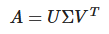
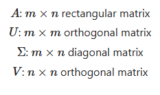
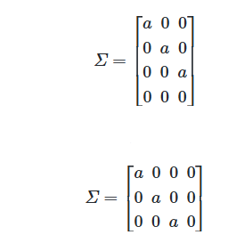
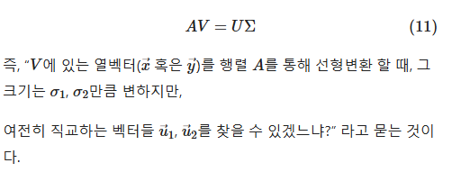
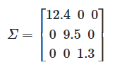

본 게시글은 아래 위키독스를 바탕으로 자연어 처리를 공부하며 정리한 내용입니다.   
※ [딥 러닝을 이용한 자연어 처리 입문](https://wikidocs.net/book/2155)

# 21. 토픽 모델링(Topic Modeling)
토픽 모델링(Topic Modeling)이란?      
: 기계 학습 및 자연어 처리 분야에서 토픽이라는 문서 집합의 추상적인 주제를 발견하기 위한 통계적 모델 중 하나    
텍스트 본문의 숨겨진 의미 구조를 발견하기 위해 사용되는 텍스트 마이닝 기법

## 잠재 의미 분석(Latent Semantic Analysis, LSA)
LSA는 토픽 모델링을 위해 최적화 된 알고리즘은 아니지만, 토픽 모델링이라는 분야에 아이디어를 제공한 알고리즘이다.

BoW에 기반한 DTM이나 TF-IDF의 단점: 기본적으로 단어의 빈도를 이용한 수치화 방법이기 때문에 단어의 의미를 고려하지 못한다. = 단어의 토픽 고려 X

=> 잠재 의미 분석(Latent Semantic Analysis, LSA): DTM의 잠재된(Latent) 의미를 이끌어내는 방법!

## 특이값 분해 관련 용어 정리




- 전치 행렬(transposed matrix): 원래의 행렬에서 행과 열을 바꾼 행렬

- 단위 행렬(identity matrix): 주대각선의 원소가 모두 1이며 나머지 원소는 모두 0인 정사각 행렬

- (A의) 역행렬: 행렬 A에 곱했을 때, 결과로서 단위 행렬이 나오게 하는 행렬 


- **비유**    
  - 단위행렬: 1
  - 역행렬: 역수

- **직교행렬(Orthogonal matrix)**: 실수 n*n 행렬 A에 대해서 A x A^T = I를 만족하면서 A^T x A = I을 만족하는 행렬 

- 단위행렬: 주대각선을 제외한 곳의 원소가 모두 0인 행렬   


- **대각행렬(diagonal matrix)**: 주대각선을 제외한 곳의 원소가 모두 0인 행렬

## 선형 변환의 관점에서 네 개의 행렬(A,V,Σ,U)의 관계


❗ **SVD를 통해 나온 대각 행렬 Σ의 추가적인 성질**    
대각 행렬 Σ의 주대각원소를 행렬 A의 특이값(singular value)라고 하며, 이 특이값은 내림차순으로 정렬됨




LSA의 경우 풀 SVD에서 나온 3개의 행렬에서 일부 벡터들을 삭제시킨 절단된 SVD(truncated SVD)를 사용

- 절단된 SVD를 수행하면 값의 손실이 일어나므로 기존의 행렬 A를 복구할 수 없다. - 또한, U행렬과 V행렬의 t열까지만 남긴다.

여기서 t는 우리가 찾고자하는 토픽의 수를 반영한 하이퍼파라미터값!

- t를 크게 잡으면 기존의 행렬 A로부터 다양한 의미를 가져갈 수 있지만, t를 작게 잡아야만 (계산 비용이 낮아질 뿐만 아니라) 노이즈를 제거할 수 있다.    
= 설명력이 낮은 정보를 삭제하고 **설명력이 높은 정보를 남긴다**

## LSA
기존의 DTM이나 DTM에 단어의 중요도에 따른 가중치를 주었던 TF-IDF 행렬은 단어의 의미를 전혀 고려하지 못했다.

LSA는 기본적으로 DTM이나 TF-IDF 행렬에 절단된 SVD(truncated SVD)를 사용하여 차원을 축소시키고, **단어들의 잠재적인 의미를 끌어낸다**는 아이디어

## LDA
토픽 모델링: 문서의 집합에서 토픽을 찾아내는 프로세스

LDA는 토픽 모델링의 대표적인 알고리즘

- LDA는 문서들이 **토픽들의 혼합**으로 구성되어져 있으며, 토픽들은 **확률 분포에 기반하여 단어들을 생성**한다고 가정
- 데이터가 주어지면, LDA는 문서가 생성되던 과정을 역추적

**예시**  
```  
문서1 : 저는 사과랑 바나나를 먹어요
문서2 : 우리는 귀여운 강아지가 좋아요
문서3 : 저의 깜찍하고 귀여운 강아지가 바나나를 먹어요
```

LDA를 수행할 때 문서 집합에서 토픽이 몇 개가 존재할지 가정하는 것은 사용자가 결정. 여기서는 LDA에 2개의 토픽을 찾도록 함(k=2)

LDA는 각 문서의 토픽 분포와 각 토픽 내의 단어 분포를 추정한다.

```
<각 문서의 토픽 분포>
문서1 : 토픽 A 100%
문서2 : 토픽 B 100%
문서3 : 토픽 B 60%, 토픽 A 40%

<각 토픽의 단어 분포>
토픽A : 사과 20%, 바나나 40%, 먹어요 40%, 귀여운 0%, 강아지 0%, 깜찍하고 0%, 좋아요 0%
토픽B : 사과 0%, 바나나 0%, 먹어요 0%, 귀여운 33%, 강아지 33%, 깜찍하고 16%, 좋아요 16%
```

LDA는 토픽의 제목을 정해주지 않고, 사용자가 위 결과로부터 두 토픽이 각각 과일에 대한 토픽과 강아지에 대한 토픽이라고 판단할 수 있다.

### LDA의 가정
- LDA는 앞서 배운 빈도수 기반의 표현 방법인 BoW의 행렬 DTM 또는 TF-IDF 행렬을 입력으로 함 => LDA는 단어의 순서는 신경쓰지 않는다!
- LDA의 가정: '나는 이 문서를 작성하기 위해서 이런 주제들을 넣을거고, 이런 주제들을 위해서는 이런 단어들을 넣을 거야.'

```
1) 문서에 사용할 단어의 개수 N을 정합니다.
- Ex) 5개의 단어를 정하였습니다.
2) 문서에 사용할 토픽의 혼합을 확률 분포에 기반하여 결정합니다.
- Ex) 위 예제와 같이 토픽이 2개라고 하였을 때 강아지 토픽을 60%, 과일 토픽을 40%와 같이 선택할 수 있습니다.
3) 문서에 사용할 각 단어를 (아래와 같이) 정합니다.
3-1) 토픽 분포에서 토픽 T를 확률적으로 고릅니다.
- Ex) 60% 확률로 강아지 토픽을 선택하고, 40% 확률로 과일 토픽을 선택할 수 있습니다.
3-2) 선택한 토픽 T에서 단어의 출현 확률 분포에 기반해 문서에 사용할 단어를 고릅니다.
- Ex) 강아지 토픽을 선택하였다면, 33% 확률로 강아지란 단어를 선택할 수 있습니다. 이제 3)을 반복하면서 문서를 완성합니다.
```

이러한 과정을 통해 문서가 작성되었다는 가정 하에 LDA는 위 과정을 역으로 추적

### LDA 수행 과정

1) 사용자는 알고리즘에게 토픽의 개수 k를 알려줍니다.

2) 모든 단어를 k개 중 하나의 토픽에 할당합니다.
- 모든 문서의 모든 단어에 대해서 k개 중 하나의 토픽을 랜덤으로 할당
- 각 문서는 토픽을 가지며, 토픽은 단어 분포를 가지게 됨

3-1) 어떤 문서의 각 단어 w는 자신은 잘못된 토픽에 할당되어져 있지만, 다른 단어들은 전부 올바른 토픽에 할당되어져 있는 상태라고 가정합니다. 이에 따라 단어 w는 아래의 두 가지 기준에 따라서 토픽이 재할당됩니다.
- p(topic t | document d) : 문서 d의 단어들 중 토픽 t에 해당하는 단어들의 비율
- p(word w | topic t) : 각 토픽들 t에서 해당 단어 w의 분포

    
doc1의 세번째 단어 apple의 토픽을 결정해보자.

    
첫번째 기준: 문서 doc1의 단어들이 어떤 토픽에 해당하는지를 본다.

 doc1의 모든 단어들은 토픽 A와 토픽 B에 50 대 50의 비율로 할당    
-> 이 기준에 따르면 단어 apple은 토픽 A 또는 토픽 B 둘 중 어디에도 속할 가능성 보유

    
두번째 기준은 단어 apple이 전체 문서에서 어떤 토픽에 할당되어져 있는지를 본다.

-> 단어 apple은 토픽 B에 할당될 가능성이 높음

=> 이러한 두 가지 기준을 참고하여 LDA는 doc1의 apple을 어떤 토픽에 할당할지 결정